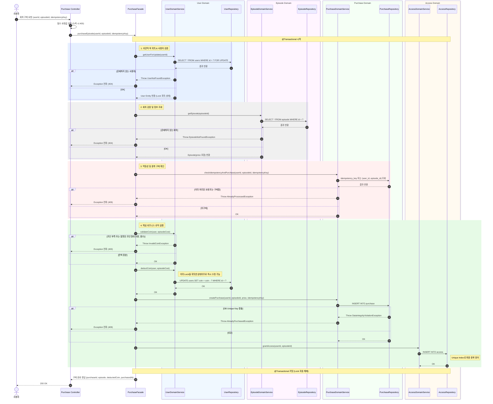
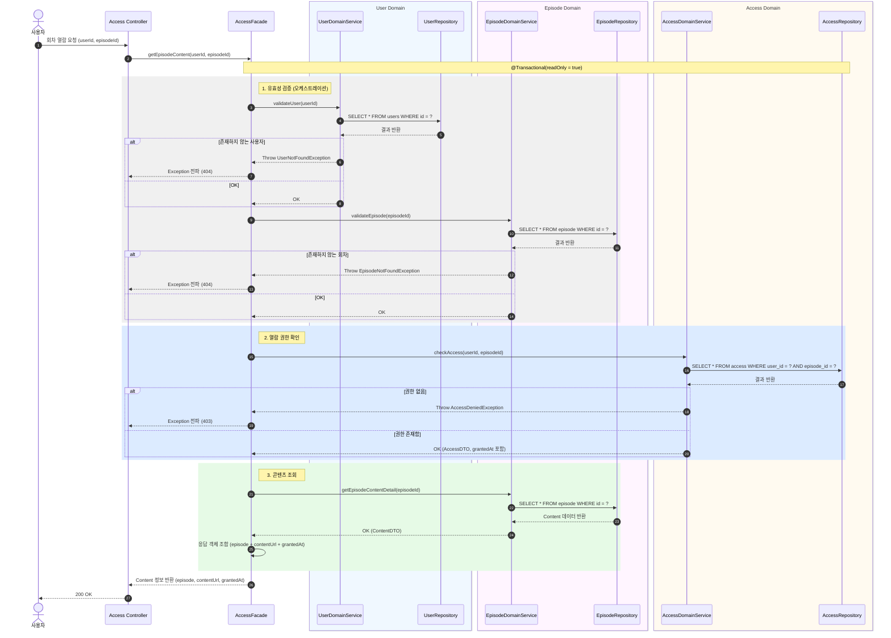

## 시퀀스 다이어그램

> 1. 회차 구매



```text
Controller 진입
userId, episodeId는 Path Variable, idempotencyKey는 Header로 받습니다. 
필수값 누락 시 Facade 도달 전 400을 반환합니다.

1. 비관적 락 획득 & 사용자 검증
트랜잭션 시작과 동시에 SELECT ... FOR UPDATE 로 users 행에 배타적 락을 겁니다. 
동일 사용자의 동시 요청은 이 시점에서 직렬화됩니다. 사용자가 없으면 404를 반환합니다.

2. 회차 검증 및 정보 조회
episode를 조회해 price를 가져옵니다. 
존재하지 않으면 404를 반환합니다.

3. 멱등성 및 중복 구매 확인
idempotency_key 단일 조회와 (user_id, episode_id) 복합 조회를 순서대로 실행합니다. 
둘 중 하나라도 이미 존재하면 409를 반환합니다. 
네트워크 오류로 인한 재전송과 신규 중복 요청을 모두 이 단계에서 차단합니다.

4. 핵심 비즈니스 로직
코인 검증(0원, 음수, 잔액 부족) -> 코인 차감 -> purchase INSERT -> access INSERT 순서로 실행됩니다. 
이미 1단계에서 락을 획득한 상태라 코인 차감은 추가 락 없이 바로 실행됩니다. 
purchase INSERT 시 DB Unique Key 충돌이 발생하면 409를 반환합니다. 
모든 단계가 하나의 트랜잭션 안에서 처리되며 중간 실패 시 전체 롤백됩니다.

트랜잭션 커밋
커밋과 동시에 FOR UPDATE로 걸었던 락이 자동 해제됩니다. 
대기 중이던 다음 요청이 락을 획득하고 3단계에서 이미 구매된 이력을 확인해 409를 반환합니다.
```

```kotlin
@Component
class PurchaseFacade(
    private val userDomainService: UserDomainService,
    private val episodeDomainService: EpisodeDomainService,
    private val purchaseDomainService: PurchaseDomainService,
    private val accessDomainService: AccessDomainService
) {

    @Transactional
    fun purchaseEpisode(userId: Long, episodeId: Long, idempotencyKey: String): PurchaseResponse {

        // 1. 비관적 락 획득 & 사용자 검증
        val user = userDomainService.getUserForUpdate(userId)

        // 2. 회차 검증 및 정보 조회
        val episode = episodeDomainService.getEpisode(episodeId)

        // 3. 멱등성 및 중복 구매 확인
        purchaseDomainService.checkIdempotencyAndPurchase(userId, episodeId, idempotencyKey)

        // 4. 코인 검증
        userDomainService.validateCoin(user, episode.price)

        // 5. 코인 차감
        userDomainService.deductCoin(user, episode.price)

        // 6. 구매 이력 생성
        val purchase = purchaseDomainService.createPurchase(userId, episodeId, episode.price, idempotencyKey)

        // 7. 열람 권한 부여
        accessDomainService.grantAccess(userId, episodeId)

        return PurchaseResponse.from(purchase, episode)
    }
}
```

> 2. 회차 열람



```text
1. 유효성 검증
사용자와 회차 존재 여부를 순서대로 확인합니다. 
각각 없으면 404를 반환합니다. 
@Transactional(readOnly = true) 로 처리되어 DB 상태를 변경하지 않습니다.

2. 열람 권한 확인
(user_id, episode_id) 기준으로 access 테이블을 조회합니다. 
레코드가 없으면 403을 반환합니다. 
다른 사용자가 구매한 회차라도 본인 access 레코드가 없으면 접근이 차단됩니다.

3. 콘텐츠 조회 및 응답 조합
episode 콘텐츠 정보를 조회한 뒤 2단계에서 가져온 grantedAt과 함께 응답 객체를 조합해 반환합니다.
```

```kotlin
@Component
class AccessFacade(
    private val userDomainService: UserDomainService,
    private val episodeDomainService: EpisodeDomainService,
    private val accessDomainService: AccessDomainService
) {

    @Transactional(readOnly = true)
    fun getEpisodeContent(userId: Long, episodeId: Long): AccessResponse {

        // 1. 유효성 검증
        userDomainService.validateUser(userId)
        episodeDomainService.validateEpisode(episodeId)

        // 2. 열람 권한 확인
        val access = accessDomainService.checkAccess(userId, episodeId)

        // 3. 콘텐츠 조회
        val content = episodeDomainService.getEpisodeContentDetail(episodeId)

        return AccessResponse.from(content, access)
    }
}
```