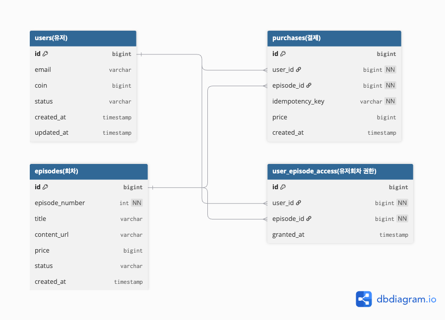

## DB 설계 (erd)


```text
Table "users(유저)" {
  id bigint [primary key]
  email varchar
  coin bigint [note: '현재 잔액']
  status varchar [default: 'ACTIVE', note: '계정 상태 (ACTIVE, BLOCK 등)']
  created_at timestamp
  updated_at timestamp [note: '마지막 잔액 변경 시점 확인용']
}

Table "episodes(회차)" {
  id bigint [primary key]
  episode_number int [not null, note: '회차 번호']
  title varchar
  content_url varchar
  price bigint
  status varchar [default: 'DISPLAY', note: '전시 상태 (DISPLAY, HIDDEN)']
  created_at timestamp
}

Table "purchases(결제)" {
  id bigint [primary key]
  user_id bigint [not null]
  episode_id bigint [not null]
  idempotency_key varchar [not null, unique, note: '중복 결제 방지용 키, 단일 인덱스']
  price bigint [note: '구매 당시 실제 지불 가격']
  created_at timestamp

  Note: '중복 결제 방지를 위해 (user_id, episode_id) 복합 유니크 인덱스'
}

Table "user_episode_access(유저회차 권한)" {
  id bigint [primary key]
  user_id bigint [not null]
  episode_id bigint [not null]
  granted_at timestamp

  Note: '중복 권한 방지를 위해 (user_id, episode_id) 복합 유니크 인덱스'
}

// 관계 설정
Ref: "purchases(결제)".user_id > "users(유저)".id
Ref: "purchases(결제)".episode_id > "episodes(회차)".id
Ref: "user_episode_access(유저회차 권한)".user_id > "users(유저)".id
Ref: "user_episode_access(유저회차 권한)".episode_id > "episodes(회차)".id
```